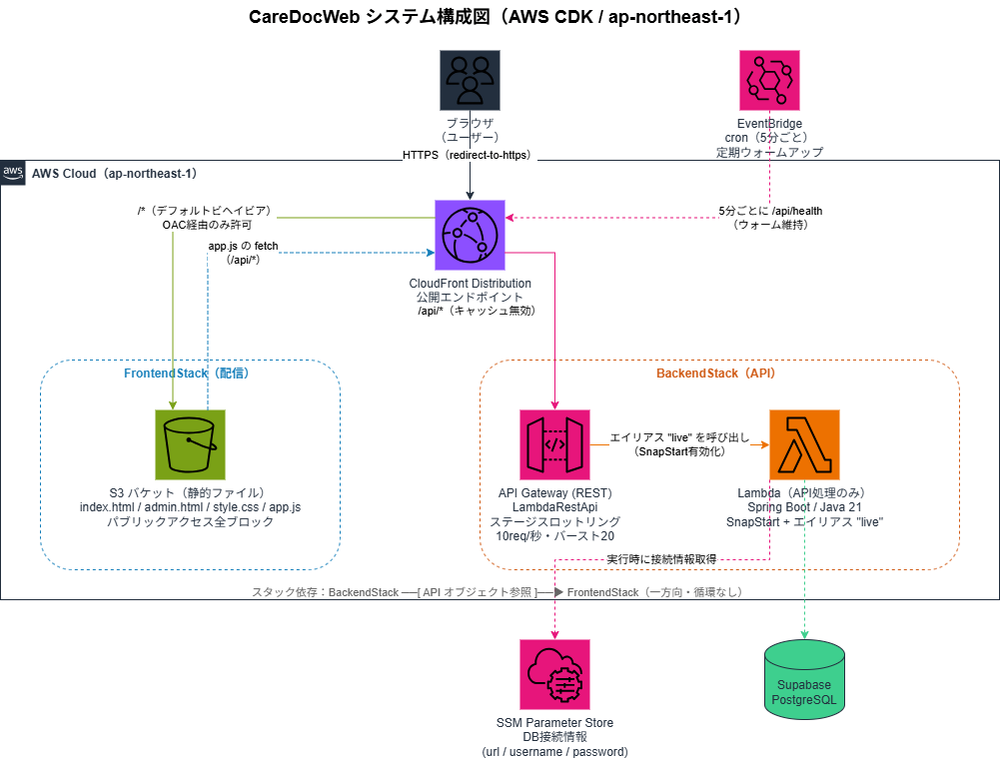

# CareDocWeb

CareDocWeb は、データベースの情報を PDF に転記して、介護認定申請書を自動作成する Web アプリケーションです。デスクトップアプリ [CareDoc](https://github.com/masalog/CareDoc) の Web 移行版になります。

公開用URL（CloudFront）<br>
**https://dre5onrtbrgty.cloudfront.net**

APIドキュメント（OpenAPI / Swagger UI）
**https://dre5onrtbrgty.cloudfront.net/swagger-ui/index.html**

CI/CD の実行状況を確認する aws コマンド
```powershell
aws codepipeline get-pipeline-state --name CareDocWebPipeline --query "stageStates[].{Stage:stageName,Status:latestExecution.status}"
```

## ✨ 主な機能
- プルダウンから名前と申請年月日を選択
- 変更更新理由の入力（変更更新の場合のみ）
- 利用者の登録・編集・削除（管理画面から）
- 共通データ（事業所・担当者情報）の編集
- 介護認定申請書 PDF の生成・ダウンロード

## 🛠 技術スタック

| 分類 | 技術 |
|------|------|
| フロントエンド | HTML / CSS / JavaScript |
| バックエンド | Java 21 / Spring Boot 4.1 |
| データベース | Supabase (PostgreSQL) / H2 |
| データアクセス | Spring Data JPA |
| PDF生成 | Apache PDFBox 3.0.4 |
| テスト | JUnit 5 / Mockito / MockMvc |
| インフラ | AWS Lambda (SnapStart) / API Gateway (REST API) / S3 / CloudFront |
| IaC | AWS CDK (Java) |
| 監視・運用 | EventBridge（定期 Health Check） |
| ビルド | Maven 4 |
| 開発環境 | IntelliJ IDEA Community Edition |

## 📐 システム構成図



## 📂 プロジェクト構成

```text
CareDocWeb/
├── docs/                        # 設計資料(要件定義・API/DB/インフラ設計書・実装方針)
├── src/
│   ├── main/
│   │   ├── java/.../CareDocWeb/
│   │   │   ├── config/          # DataSource 設定(SSM から接続情報取得)・初期データ投入
│   │   │   ├── controller/      # REST API(公開 API と管理 API /api/admin/** を分離)
│   │   │   ├── dto/             # リクエスト DTO
│   │   │   ├── entity/          # エンティティ(Member, CommonSettings)
│   │   │   ├── exception/       # 共通例外ハンドリング
│   │   │   ├── repository/      # Spring Data JPA リポジトリ
│   │   │   └── service/         # 業務ロジック・PDF 生成
│   │   └── resources/
│   │       ├── static/          # フロントエンド(S3 + CloudFront 配信、admin は Cognito 認証)
│   │       ├── fonts/           # PDF 埋め込み用日本語フォント
│   │       ├── positions/       # PDF 座標定義
│   │       └── templates/       # PDF テンプレート
│   └── test/                    # コントローラー統合テスト・サービス単体テスト
├── cdk/                   
│   └── src/.../cdk/             # Pipeline / Backend / Frontend スタック、Cognito コンストラクト
├── pom.xml
├── README.md
└── SECURITY.md
```

## 🗄 DBテーブル

| テーブル | 説明 |
|----------|------|
| `members` | 利用者ごとに1レコード（被保険者番号、氏名、生年月日、介護度など） |
| `common_settings` | 事業所全体で1レコード（調査先、施設、代理人、クリニック情報） |

※ 詳細は [DB設計書](docs/CareDocWeb%20DB設計書.md) を参照

## 🧪 テスト

全106件パス（JUnit 5 + Mockito + MockMvc）

| テストクラス | テスト数 | 対象 |
|---|---|---|
| CareDocWebApplicationTests | 1 | コンテキスト起動 |
| MemberControllerTest | 18 | 利用者API（HTTP検証） |
| CommonSettingsControllerTest | 10 | 共通設定API（HTTP検証） |
| PdfControllerTest | 14 | PDF生成API（HTTP検証） |
| HealthControllerTest | 3 | ヘルスチェックAPI（HTTP検証） |
| MemberServiceImplTest | 25 | 利用者サービス（ロジック検証） |
| CommonSettingsServiceImplTest | 16 | 共通設定サービス（ロジック検証） |
| PdfServiceImplTest | 19 | PDF生成サービス（バイナリ生成検証） |

```powershell
mvn clean test
```

## 🚀 開発フェーズ

| Phase | 内容                                                                                         | 状態                                                                                          |
|-------|--------------------------------------------------------------------------------------------|---------------------------------------------------------------------------------------------|
| 1     | 利用者選択 → PDF生成（インメモリDB, 認証なし, ローカル実行）                                                       | ✅ 完了                                                                                        |
| 2     | Supabase接続                                                                                 | ✅ 完了                                                                                        |
| 3     | フロントエンド（S3 + CloudFront）を CDK でデプロイ                                                        | ✅ 完了                                                                                        |
| 4     | Lambda SnapStart + API Gateway（REST API）を CDK でデプロイ                                        | ✅ 完了                                                                                        |
| 5     | CloudFront から `/api/*` を API Gateway へルーティング（同一オリジン化・CORS不要）+ PDF等バイナリ配信（binaryMediaTypes） | ✅ 完了 |
| 6     | SnapStartエイリアス化でコールドスタート改善 + 定期ウォームアップ（EventBridge cron → /api/health）                     | ✅ 完了                                                                                        |
| 7     | CodeBuild と CodePipeline で CI/CD を実現                                                       | ✅ 完了                                                                                        |

## ☁️ インフラ（AWS CDK）

インフラは **AWS CDK（Java）** でコード化（IaC）しています。
詳細は [インフラ設計書（CDK）](docs/CareDocWeb%20インフラ設計書（CDK）.md) を参照。

| リソース | 役割 |
|----------|------|
| S3 | フロントエンド静的ファイル格納（パブリックアクセス全ブロック） |
| CloudFront | HTTPS配信・CDN。OAC で S3 へのアクセスを制御 |
| Lambda + API Gateway | Spring Boot API を REST API で公開（SnapStart・使用量プラン） |

> CloudFront を公開エンドポイントとし、`/*` は S3、`/api/*` は API Gateway へ
> ルーティングする統合が完了済み。フロントとAPIが同一オリジンのため CORS 不要。

## 🏗 ビルド・実行方法

※ JAVA_HOME には Java 21 JDK のパス設定が必要です

### ローカル実行（H2インメモリDB）

```powershell
cd C:\Users\dghy1\IdeaProjects\CareDocWeb

mvn spring-boot:run
```

デフォルトで `local` プロファイル（H2）が適用されます。

### Supabase接続（本番DB）

```powershell
$env:DB_URL = "jdbc:postgresql://your-supabase-host:5432/postgres?sslmode=require"
$env:DB_USERNAME = "postgres.your-project-id"
$env:DB_PASSWORD=[REDACTED_PASSWORD]
$env:SPRING_PROFILES_ACTIVE = "prod"

mvn spring-boot:run
```

### Lambda用ビルド

```powershell
mvn clean package -DskipTests
```

`target/CareDocWeb-0.0.1-SNAPSHOT.jar` が生成されます。

### PDF生成の動作確認

```powershell
# 利用者一覧からIDを取得
(Invoke-WebRequest http://localhost:8080/api/members -UseBasicParsing).Content

# PDF生成
Invoke-WebRequest -Uri "http://localhost:8080/api/pdf/generate" `
  -Method POST `
  -ContentType "application/json" `
  -Body '{"memberId":"取得したUUID","applicationYear":2026,"applicationMonth":7,"applicationDay":2}' `
  -OutFile "output.pdf" `
  -UseBasicParsing
```

## ☁️ インフラ構成（AWS）

| リソース | 用途 |
|----------|------|
| Lambda（Java 21 + SnapStart） | Spring Boot API 実行 |
| API Gateway（REST API） | HTTPリクエストをLambdaに転送。使用量プラン（APIキー・レート制限） |
| S3 | フロントエンド静的ホスティング |
| CloudFront | HTTPS配信・CDN（OACでS3を保護） |
| SSM Parameter Store | DB接続情報（URL/ユーザー名/パスワード）を実行時取得 |
| Supabase | PostgreSQL データベース |

### Lambda設定

| 項目 | 値 |
|------|-----|
| ハンドラー | `com.example.CareDocWeb.StreamLambdaHandler::handleRequest` |
| ランタイム | Java 21 |
| SnapStart | PublishedVersions |
| メモリ | 2048MB（2GB） |
| タイムアウト | 30秒 |

## 💰 運用コスト（見込み）

| 項目 | 月額 |
|------|------|
| Lambda（無料枠: 100万リクエスト/月） | ほぼ $0 |
| API Gateway | ほぼ $0 |
| S3（静的ホスティング） | ほぼ $0 |
| Supabase（Free） | $0 |
| **合計** | **ほぼ無料** |

## 💰 今後の課題

・管理画面の日付表示が機能するように修正する<br>
・認証/認可の機能を実装する<br>
・ユーザー毎にデータベースにアクセスできる範囲を制限する

## 🧑‍💻 留意点
※1. 本テンプレートは、東京都中央区が公開している介護認定申請書の様式を参考に作成したものです。
正式な手続きの際には、中央区が提供する最新の書式をご使用くださいますようお願いいたします。
なお、本書類の利用により生じた損害等について、作成者は一切の責任を負いません。

※2．医療保険と特定疾病名の項目は、第2号被保険者向けの記載欄で、ユースケースが少ない事から、
現時点では自動転記の対象としておりません。

※3．個人番号は、現時点では記載が求められないことが多いため、自動転記の対象としていません。
