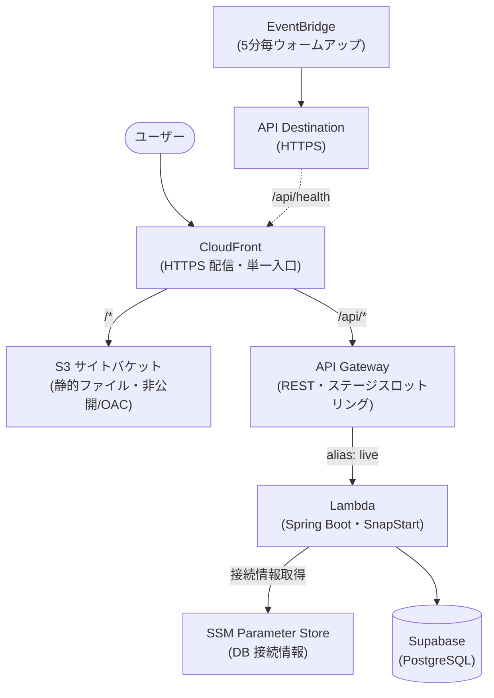
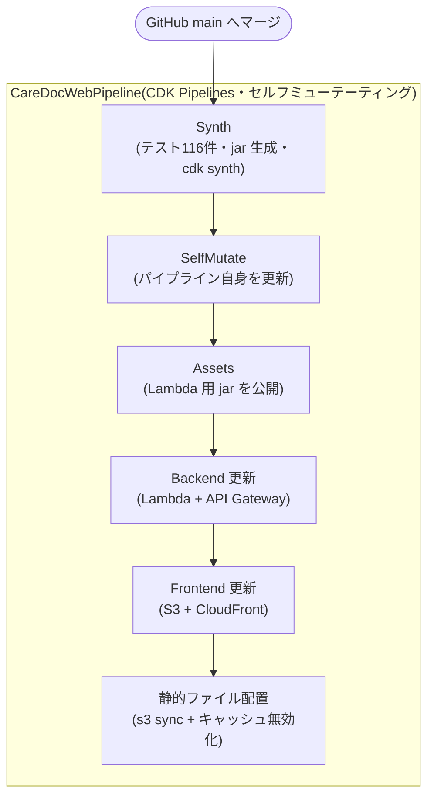

# システム構成

## ランタイム構成

CloudFront が唯一の公開エンドポイント。`/*` は S3 の静的ファイルへ、`/api/*` は API Gateway 経由で Lambda へルーティングされる(同一オリジンのため CORS 不要)。

## CI/CD パイプライン(CDK Pipelines)

`main` へのマージだけで、テスト実行からインフラ更新・静的ファイル配置・キャッシュ無効化までが全自動で実行される。パイプライン定義自体の変更も SelfMutate により自己反映される。

